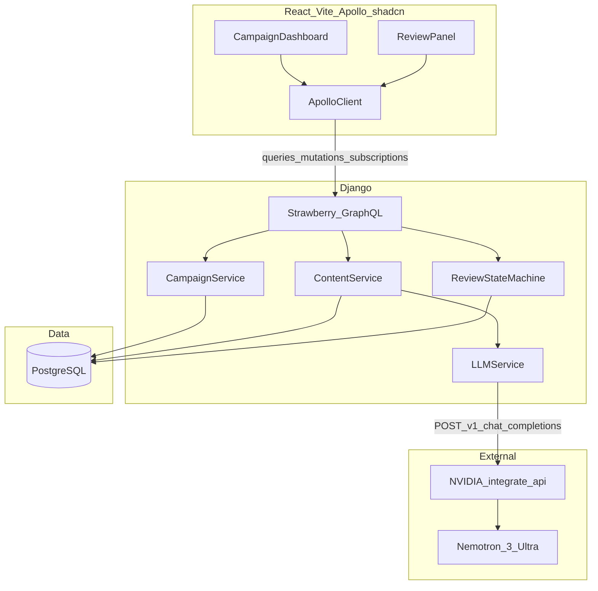

# TRD: ACME GLOBAL MEDIA — AI Content Workflow

Technical design for the product defined in [docs/prd.md](./prd.md).

---

## Scope

### In scope (v1 / P0)

- **Django** backend with **Strawberry GraphQL** (client-mandated stack)
- **React** frontend (Vite) with **Apollo Client**, **shadcn/ui**, and **Tailwind CSS**
- **PostgreSQL** persistence
- **NVIDIA Nemotron 3 Ultra** for AI draft and translation via OpenAI-compatible hosted API
- Review state machine per PRD (`Draft` → `SuggestedByAI` → `Reviewed` → `Approved` / `Rejected`)
- GraphQL **subscriptions** for real-time dashboard updates
- **Docker Compose** for local development (backend, frontend, database)
- Harness-aligned phased delivery (`AGENTS.md`, optional `feature_list.json` in Phase 1+)

### Out of scope (v1)

- Authentication / SSO (shared demo workspace acceptable)
- REST API surface for **application features** (GraphQL only for product API)
- Self-hosted NVIDIA NIM containers (hosted `integrate.api.nvidia.com` only)
- Kafka, Redis, Kubernetes, ArgoCD
- LangChain, multi-model comparison (P1)
- Production deployment and billing

### PRD mapping note

The PRD references OpenAI/Anthropic generically (challenge brief). This TRD **narrows** the P0 LLM provider to **NVIDIA Nemotron** per client/training requirement. OpenAI/Anthropic remain optional P1 alternates via the same `LLMService` adapter.

---

## Architecture Overview

### Component diagram



Client stack: **Vite**, **React**, **Apollo Client** (data), **shadcn/ui** + **Tailwind CSS** (UI).

### Request flow (mutation + real-time)

1. React client sends GraphQL mutation (e.g. `generateDraft`).
2. Strawberry resolver delegates to domain service (`ContentService`).
3. Service validates state, calls `LLMService` if needed, persists to PostgreSQL.
4. On success, resolver publishes subscription event (`contentPieceUpdated`).
5. All subscribed clients receive updated piece/campaign data.

### AI flow (draft / translate)

1. `generateDraft` or `translateContent` mutation receives `contentPieceId` (+ `targetLocale` for translate).
2. `ContentService` builds prompt from piece metadata and campaign context.
3. `LLMService` calls Nemotron via OpenAI-compatible client.
4. On success: create `ContentSuggestion` row; set `review_status` → `SuggestedByAI`; update `current_text` optionally from suggestion preview.
5. On failure: return GraphQL error; **no** status transition; prior state unchanged.

### Target repository layout

Django project package is `config/` (settings, URL routing, ASGI/WSGI). Domain logic lives in apps; Strawberry schema lives in `graphql/`.

```
/
├── backend/
│   ├── config/              # Django project package
│   │   ├── settings/        # base, local, test
│   │   ├── urls.py          # HTTP routing (GraphQL + non-GraphQL)
│   │   ├── asgi.py          # ASGI app (subscriptions)
│   │   └── wsgi.py
│   ├── campaigns/           # models, services
│   ├── content/             # ContentPiece, suggestions, review FSM
│   ├── ai/                  # LLMService, Nemotron client
│   ├── graphql/             # Strawberry schema, resolvers, subscriptions
│   ├── manage.py
│   ├── requirements.txt
│   └── Dockerfile
├── frontend/
│   ├── src/
│   │   ├── components/
│   │   │   └── ui/          # shadcn components (Button, Table, Badge, …)
│   │   ├── lib/             # utils (cn helper)
│   │   └── ...
│   ├── components.json      # shadcn CLI config
│   ├── tailwind.config.ts
│   ├── postcss.config.js
│   ├── package.json
│   └── Dockerfile
├── compose.yml
├── .env.example
├── docs/
│   ├── prd.md
│   ├── trd.md
│   └── adr/
└── README.md
```

### HTTP routing (`config/urls.py`)

**Application API** is GraphQL-only (client mandate). **HTTP routing** still uses Django’s standard `config/urls.py` so non-GraphQL endpoints can be added without restructuring.

| Path | Handler | Purpose |
|------|---------|---------|
| `/graphql/` | Strawberry `GraphQLView` / `AsyncGraphQLView` | Queries, mutations, subscriptions (P0 app API) |
| `/health/` | Django view | Docker / load balancer liveness (P0) |
| `/admin/` | Django admin | Data inspection during development (P0 optional) |

**Why this pattern:**

- **Single routing table** — all HTTP entry points in one place; middleware (CORS, security, logging) applies uniformly.
- **GraphQL stays thin at the URL layer** — `urls.py` only mounts the schema; types and resolvers remain in `graphql/`.
- **Extensibility** — add `/health/`, webhooks, or file downloads later without changing the GraphQL schema or client contract.
- **Subscriptions** — `config/asgi.py` serves `/graphql/` over ASGI; same path as queries/mutations.

**Example `config/urls.py`:**

```python
from django.contrib import admin
from django.http import JsonResponse
from django.urls import path
from strawberry.django.views import AsyncGraphQLView

from graphql.schema import schema


def health(_request):
    return JsonResponse({"status": "ok"})


urlpatterns = [
    path("admin/", admin.site.urls),
    path("health/", health),
    path("graphql/", AsyncGraphQLView.as_view(schema=schema)),
]
```

The React frontend talks to **`/graphql/`** only. Health and admin are for ops and local debugging.

### Frontend UI stack

| Item | Choice |
|------|--------|
| UI components | **shadcn/ui** (Radix primitives, copy-paste into repo) |
| Styling | **Tailwind CSS** |
| Tooling | `shadcn` CLI init on Vite + React + TypeScript |

**PRD UI mapping (P0):**

| PRD need | shadcn components |
|----------|-------------------|
| Campaign dashboard | `Table`, `Card`, layout |
| Create campaign / content | `Dialog` or `Sheet`, `Form`, `Input`, `Textarea` |
| Review workflow | `Textarea`, `Button`, side-by-side `Card` |
| Review status | `Badge` (variant per `ReviewStatus`) |
| AI loading / errors | `Skeleton`, `Alert` or toast (sonner) |

shadcn/ui fits the one-week training window: components are owned in the repo (no heavy runtime UI framework), scaffold quickly with the CLI, work natively with Vite, and stay accessible via Radix UI primitives.

---

## Data Model / API Contracts

### Django models

#### `Campaign`

| Field | Type | Notes |
|-------|------|-------|
| `id` | UUID PK | |
| `name` | CharField | Required |
| `description` | TextField | Optional |
| `target_locales` | JSONField / ArrayField | e.g. `["en-US", "es-ES"]` |
| `created_at` | DateTime | auto |
| `updated_at` | DateTime | auto |

#### `ContentPiece`

| Field | Type | Notes |
|-------|------|-------|
| `id` | UUID PK | |
| `campaign` | FK → Campaign | CASCADE |
| `type` | CharField | `headline`, `description`, etc. |
| `source_locale` | CharField | BCP-47 |
| `current_text` | TextField | Human-editable body |
| `review_status` | CharField | Enum (see below) |
| `created_at` | DateTime | auto |
| `updated_at` | DateTime | auto |

#### `ContentSuggestion`

| Field | Type | Notes |
|-------|------|-------|
| `id` | UUID PK | |
| `content_piece` | FK → ContentPiece | |
| `provider` | CharField | `nvidia` (P0) |
| `model` | CharField | `nvidia/nemotron-3-ultra-550b-a55b` |
| `suggested_text` | TextField | LLM output |
| `metadata` | JSONField | P1: keywords, tone, sentiment |
| `created_at` | DateTime | auto |

#### `ReviewEvent` (optional P1)

| Field | Type | Notes |
|-------|------|-------|
| `id` | UUID PK | |
| `content_piece` | FK | |
| `from_status` | CharField | |
| `to_status` | CharField | |
| `note` | TextField | Rejection reason, etc. |
| `created_at` | DateTime | auto |

### Review status enum

```graphql
enum ReviewStatus {
  DRAFT
  SUGGESTED_BY_AI
  REVIEWED
  APPROVED
  REJECTED
}
```

**Valid transitions** (enforced in `ReviewStateMachine`):

| From | To |
|------|-----|
| `DRAFT` | `SUGGESTED_BY_AI` (via AI mutation) |
| `SUGGESTED_BY_AI` | `REVIEWED`, `APPROVED`, `REJECTED` |
| `REVIEWED` | `APPROVED`, `REJECTED` |
| `REJECTED` | `DRAFT` (explicit reset mutation) |
| `APPROVED` | — (terminal for v1) |

Invalid transitions raise a GraphQL error with code `INVALID_REVIEW_TRANSITION`.

### GraphQL schema (P0 sketch)

```graphql
type Campaign {
  id: ID!
  name: String!
  description: String
  targetLocales: [String!]!
  contentPieces: [ContentPiece!]!
  createdAt: DateTime!
  updatedAt: DateTime!
}

type ContentPiece {
  id: ID!
  campaign: Campaign!
  type: String!
  sourceLocale: String!
  currentText: String!
  reviewStatus: ReviewStatus!
  latestSuggestion: ContentSuggestion
  updatedAt: DateTime!
}

type ContentSuggestion {
  id: ID!
  suggestedText: String!
  provider: String!
  model: String!
  metadata: JSON
  createdAt: DateTime!
}

type Query {
  campaigns: [Campaign!]!
  campaign(id: ID!): Campaign
}

type Mutation {
  createCampaign(input: CreateCampaignInput!): Campaign!
  createContentPiece(input: CreateContentPieceInput!): ContentPiece!
  updateContentPiece(input: UpdateContentPieceInput!): ContentPiece!
  transitionReviewStatus(input: TransitionReviewInput!): ContentPiece!
  generateDraft(contentPieceId: ID!): ContentPiece!
  translateContent(contentPieceId: ID!, targetLocale: String!): ContentPiece!
  resetContentPiece(contentPieceId: ID!): ContentPiece!
}

type Subscription {
  contentPieceUpdated(campaignId: ID): ContentPiece!
  campaignUpdated: Campaign!
}
```

### PRD acceptance criteria — technical response

| PRD criterion | TRD response |
|---------------|--------------|
| GraphQL + PostgreSQL | Django ORM + Strawberry on `/graphql` |
| CRUD campaigns/pieces | `createCampaign`, `createContentPiece`, `updateContentPiece` |
| AI draft / translate | `generateDraft`, `translateContent` → `LLMService` → Nemotron |
| Review transitions | `transitionReviewStatus` + `ReviewStateMachine` |
| Nested queries | `Campaign.contentPieces`, `ContentPiece.latestSuggestion` |
| Env-based API keys | `NVIDIA_API_KEY` in `.env.example`; fail fast if missing |
| Real-time updates | GraphQL subscriptions after successful mutations |
| Docker local run | `compose.yml`: `db`, `backend`, `frontend`; health check on `/health/` |
| GraphQL-only justification | App API at `/graphql/`; subscriptions; client stack mandate; ops routes via `urls.py` |

---

## Technical Decisions

### Fixed (client mandate — not open for debate)

| Constraint | Choice | Reference |
|------------|--------|-----------|
| Backend | **Django** | [ADR-001](./adr/ADR-001.md) (ratification, PHASE-0.5) |
| GraphQL library | **Strawberry** | [ADR-002](./adr/ADR-002.md) (ratification, PHASE-0.6) |
| API style | **GraphQL only** (app API) | Product queries/mutations/subscriptions via `/graphql/`; see [HTTP routing](#http-routing-configurls) for `/health/`, `/admin/` |
| LLM provider (P0) | **NVIDIA Nemotron 3 Ultra** | [build.nvidia.com](https://build.nvidia.com/nvidia/nemotron-3-ultra-550b-a55b) |

### TRD-owned decisions

| Decision | Choice | Rationale |
|----------|--------|-----------|
| LLM client | Python `openai` SDK + `LLMService` | Nemotron exposes OpenAI-compatible API |
| Reasoning mode | `enable_thinking: False` for P0 | Direct marketing copy output; faster responses |
| Real-time | Strawberry subscriptions | Aligns with GraphQL-only stack |
| HTTP routing | `config/urls.py` mounts `/graphql/` + `/health/` + `/admin/` | Standard Django entry point; room for non-GraphQL paths without restructuring |
| Frontend | Vite + React + **Apollo Client** + **shadcn/ui** | GraphQL via `@apollo/client`; UI via shadcn + Tailwind |
| UI library | **shadcn/ui + Tailwind CSS** | Dashboard, forms, review panel; components owned in repo |
| Harness | `AGENTS.md` + optional `feature_list.json` | [ADR-003](./adr/ADR-003.md) (PHASE-0.7) |
| Alt LLM providers (P1) | OpenAI / Anthropic via same adapter | Challenge bonus; not P0 |

### LLM integration — NVIDIA Nemotron

| Item | Value |
|------|-------|
| Base URL | `https://integrate.api.nvidia.com/v1` |
| Endpoint | `POST /chat/completions` |
| Model ID | `nvidia/nemotron-3-ultra-550b-a55b` |
| Auth | `NVIDIA_API_KEY` (`nvapi-...`) from [build.nvidia.com](https://build.nvidia.com) — **Public API Endpoints** scope |
| OpenAPI reference | [NIM infer docs](https://docs.api.nvidia.com/nim/reference/nvidia-nemotron-3-ultra-550b-a55b-infer) |

**`LLMService` example (draft generation):**

```python
import os
from openai import OpenAI

class LLMService:
    def __init__(self) -> None:
        self._client = OpenAI(
            base_url=os.environ.get(
                "NVIDIA_BASE_URL", "https://integrate.api.nvidia.com/v1"
            ),
            api_key=os.environ["NVIDIA_API_KEY"],
        )
        self._model = os.environ.get(
            "NVIDIA_MODEL", "nvidia/nemotron-3-ultra-550b-a55b"
        )

    def generate_draft(self, system_prompt: str, user_prompt: str) -> str:
        response = self._client.chat.completions.create(
            model=self._model,
            messages=[
                {"role": "system", "content": system_prompt},
                {"role": "user", "content": user_prompt},
            ],
            temperature=0.7,
            max_tokens=1024,
            extra_body={"chat_template_kwargs": {"enable_thinking": False}},
        )
        content = response.choices[0].message.content
        if not content or not content.strip():
            raise LLMEmptyResponseError("Nemotron returned empty content")
        return content.strip()
```

**curl equivalent:**

```bash
curl https://integrate.api.nvidia.com/v1/chat/completions \
  -H "Content-Type: application/json" \
  -H "Authorization: Bearer $NVIDIA_API_KEY" \
  -d '{
    "model": "nvidia/nemotron-3-ultra-550b-a55b",
    "messages": [
      {"role": "system", "content": "You are a marketing copywriter for ACME GLOBAL MEDIA."},
      {"role": "user", "content": "Draft a headline for a summer campaign in en-US."}
    ],
    "temperature": 0.7,
    "max_tokens": 1024,
    "chat_template_kwargs": {"enable_thinking": false}
  }'
```

**Environment variables (`.env.example`):**

```bash
NVIDIA_API_KEY=nvapi-...
NVIDIA_BASE_URL=https://integrate.api.nvidia.com/v1
NVIDIA_MODEL=nvidia/nemotron-3-ultra-550b-a55b

DATABASE_URL=postgres://app:app@db:5432/acme_content
DJANGO_SECRET_KEY=change-me
DJANGO_DEBUG=1
```

---

## Dependencies

| Dependency | Role | Phase |
|------------|------|-------|
| Python 3.12+ | Backend runtime | 2+ |
| Django 5.x | Web framework | 2+ |
| Strawberry GraphQL | API layer | 2+ |
| PostgreSQL 16 | Primary datastore | 2+ |
| `openai` Python SDK | Nemotron client | 3+ |
| Node 20+ | Frontend toolchain | 4+ |
| React 18 + Vite | UI shell | 4+ |
| Apollo Client | GraphQL + subscriptions (`@apollo/client`) | 4+ |
| Tailwind CSS | Utility styling | 4+ |
| shadcn/ui | UI components (Radix + Tailwind) | 4+ |
| Docker Compose | Local orchestration | 5 |

---

## Risks and Constraints

| Risk | Impact | Mitigation |
|------|--------|------------|
| One-week training window | Scope creep | Strict P0; defer P1 |
| NVIDIA API latency / rate limits | Slow or failed mutations | Timeouts; clear GraphQL errors; no partial saves |
| Nemotron reasoning overhead | Extra tokens, slower drafts | `enable_thinking: False` for P0 |
| Strawberry subscription setup | Implementation complexity | Spike in Phase 5; document SSE fallback as contingency |
| Solo developer | Context switching | Harness WIP=1; incremental phases per PRD |
| PRD vs TRD LLM provider mismatch | Reviewer confusion | This TRD explicitly narrows to Nemotron; PRD update optional |

---

## Testing Strategy

| Layer | Tooling | Scope |
|-------|---------|-------|
| Review state machine | `pytest` unit tests | All valid/invalid transitions |
| GraphQL resolvers | Django test client / `pytest` + Strawberry test utilities | Mutations, queries, error paths |
| `LLMService` | `unittest.mock` on `openai.OpenAI` | No live NVIDIA calls in CI |
| Models | Django ORM tests | Constraints, FK cascades |
| Frontend | Vitest + RTL (P1) | Review panel, loading states |
| E2E | Manual demo script | Two browser tabs + subscription |
| Docker | `docker compose up` smoke | Health check on `/health/`; GraphQL introspection on `/graphql/` |

**CI (P1):** GitHub Actions — `pytest` backend, `npm test` frontend, no secrets (mocked LLM).

---

## Implementation Plan

Ordered phases for **one week or less** (see [PRD timeline](./prd.md#timeline)).

| Phase | Deliverable | PRD P0 covered |
|-------|-------------|----------------|
| **0 — Bootstrap** | PRD, TRD, ADRs | Docs |
| **1 — Harness** | `AGENTS.md`, `backend/` + `frontend/` scaffold | Harness entry |
| **2 — Backend core** | Django models, migrations, GraphQL CRUD, `ReviewStateMachine` | Backend P0 (except AI) |
| **3 — AI layer** | `LLMService`, Nemotron integration, `generateDraft`, `translateContent` | AI mutations |
| **4 — Frontend** | Vite scaffold, shadcn init, dashboard + review UI, Apollo Client | Frontend P0 (except real-time) |
| **5 — Real-time + Docker** | Subscriptions, `compose.yml`, README setup | Real-time + Docker + README |
| **6 — Polish** | Tests, CI, P1 features | Optional |

**MVP:** Phases 1–5 P0 only.

---

## Related

| Artifact | Path | Status |
|----------|------|--------|
| PRD | [docs/prd.md](./prd.md) | Approved (PR #2) |
| ADR-001 Django | [docs/adr/ADR-001.md](./adr/ADR-001.md) | PHASE-0.5 (`86e1ykv7w`) |
| ADR-002 Strawberry | [docs/adr/ADR-002.md](./adr/ADR-002.md) | PHASE-0.6 (`86e1ykv94`) |
| ADR-003 Harness | [docs/adr/ADR-003.md](./adr/ADR-003.md) | PHASE-0.7 (`86e1ykvbp`) |
| ClickUp | [86e1ykv65](https://app.clickup.com/t/86e1ykv65) | PHASE-0.4 |
